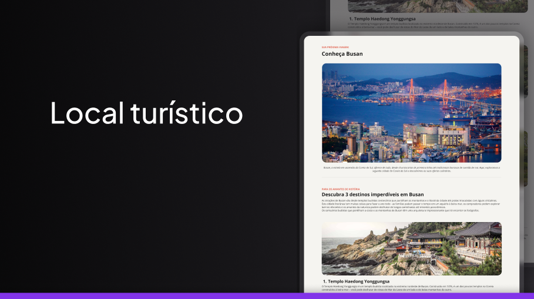

<h1 align="center"> Locais Turísticos da Coreia do sul </h1>

  <a href="#-tecnologias">Tecnologias</a>&nbsp;&nbsp;&nbsp;|&nbsp;&nbsp;&nbsp;
  <a href="#-projeto">Projeto</a>

 

  

## 🚀 Tecnologias

Esse projeto foi desenvolvido com as seguintes tecnologias:

- HTML e CSS
- Git e Github
- Figma

## 💻 Projeto

Uma página de uma receita de cupcake de café com chantilly com o intuito de praticar um pouco mais meus estudos em html e css.

---

Feito com ♥ by Dani & Rocketseat :wave:
